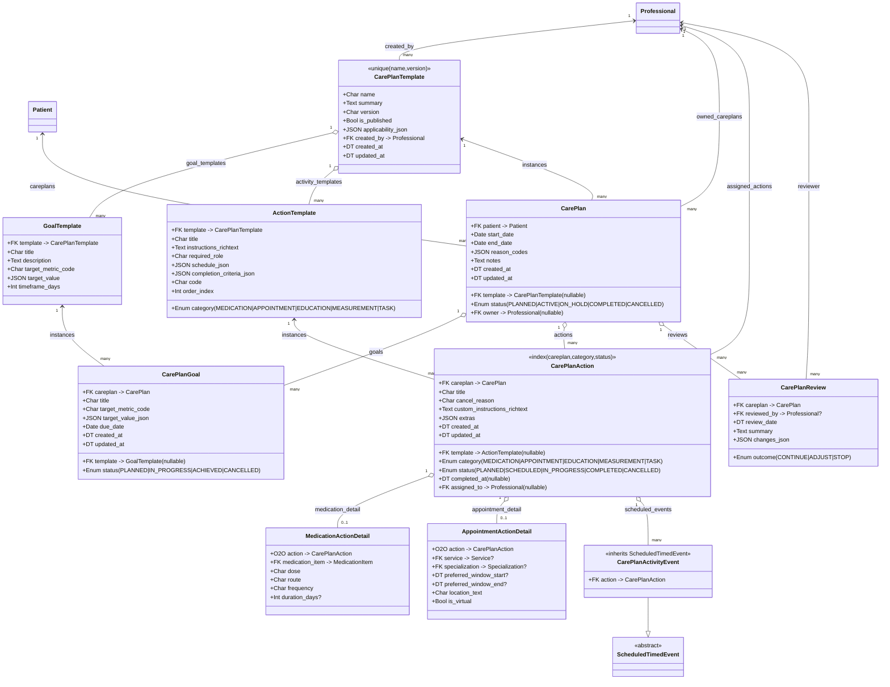

```mermaid
classDiagram
  %% ===== External / referenced models (from other apps) =====
  class Patient
  class Professional
  class ScheduledTimedEvent {
    <<abstract>>
  }

  %% ===== Templates =====
  class CarePlanTemplate {
    +Char name
    +Text summary
    +Char version
    +Bool is_published
    +JSON applicability_json
    +FK created_by -> Professional
    +DT created_at
    +DT updated_at
    <<unique(name,version)>>
  }

  class GoalTemplate {
    +FK template -> CarePlanTemplate
    +Char title
    +Text description
    +Char target_metric_code
    +JSON target_value
    +Int timeframe_days
  }

  class ActionTemplate {
    +FK template -> CarePlanTemplate
    +Char title
    +Enum category (MEDICATION|APPOINTMENT|EDUCATION|MEASUREMENT|TASK)
    +Text instructions_richtext
    +Char required_role
    +JSON schedule_json
    +JSON completion_criteria_json
    +Char code
    +Int order_index
  }

  CarePlanTemplate "1" o-- "many" GoalTemplate : goal_templates
  CarePlanTemplate "1" o-- "many" ActionTemplate : activity_templates
  Professional "1" <-- "many" CarePlanTemplate : created_by

  %% ===== Care Plan instances =====
  class CarePlan {
    +FK patient -> Patient
    +FK template -> CarePlanTemplate (nullable)
    +Enum status (PLANNED|ACTIVE|ON_HOLD|COMPLETED|CANCELLED)
    +Date start_date
    +Date end_date
    +FK owner -> Professional (nullable)
    +JSON reason_codes
    +Text notes
    +DT created_at
    +DT updated_at
  }
  Patient "1" <-- "many" CarePlan : careplans
  CarePlanTemplate "1" <-- "many" CarePlan : instances
  Professional "1" <-- "many" CarePlan : owned_careplans

  class CarePlanGoal {
    +FK careplan -> CarePlan
    +FK template -> GoalTemplate (nullable)
    +Char title
    +Char target_metric_code
    +JSON target_value_json
    +Date due_date
    +Enum status (PLANNED|IN_PROGRESS|ACHIEVED|CANCELLED)
    +DT created_at
    +DT updated_at
  }
  CarePlan "1" o-- "many" CarePlanGoal : goals
  GoalTemplate "1" <-- "many" CarePlanGoal : instances

  %% ===== Actions + per-category details =====
  class CarePlanAction {
    +FK careplan -> CarePlan
    +FK template -> ActionTemplate (nullable)
    +Enum category (MEDICATION|APPOINTMENT|EDUCATION|MEASUREMENT|TASK)
    +Char title
    +Enum status (PLANNED|SCHEDULED|IN_PROGRESS|COMPLETED|CANCELLED)
    +Char cancel_reason
    +DT completed_at (nullable)
    +Text custom_instructions_richtext
    +FK assigned_to -> Professional (nullable)
    +JSON extras
    +DT created_at
    +DT updated_at
    <<index(careplan,category,status)>>
    <<index(category,status)>>
  }
  CarePlan "1" o-- "many" CarePlanAction : actions
  ActionTemplate "1" <-- "many" CarePlanAction : instances
  Professional "1" <-- "many" CarePlanAction : assigned_actions

  class MedicationActionDetail {
    +O2O action -> CarePlanAction
    +FK medication_item -> MedicationItem
    +Char dose
    +Char route
    +Char frequency
    +Int duration_days?
  }
  CarePlanAction "1" o-- "0..1" MedicationActionDetail : medication_detail

  class AppointmentActionDetail {
    +O2O action -> CarePlanAction
    +FK service -> Service?
    +FK specialization -> Specialization?
    +DT preferred_window_start?
    +DT preferred_window_end?
    +Char location_text
    +Bool is_virtual
  }
  CarePlanAction "1" o-- "0..1" AppointmentActionDetail : appointment_detail

  %% ===== Scheduled occurrences =====
  class CarePlanActivityEvent {
    +FK action -> CarePlanAction
    <<inherits ScheduledTimedEvent>>
  }
  CarePlanActivityEvent --|> ScheduledTimedEvent
  CarePlanAction "1" o-- "many" CarePlanActivityEvent : scheduled_events

  %% ===== Reviews =====
  class CarePlanReview {
    +FK careplan -> CarePlan
    +FK reviewed_by -> Professional?
    +DT review_date
    +Text summary
    +Enum outcome (CONTINUE|ADJUST|STOP)
    +JSON changes_json
  }
  CarePlan "1" o-- "many" CarePlanReview : reviews
  Professional "1" <-- "many" CarePlanReview : reviewer

```